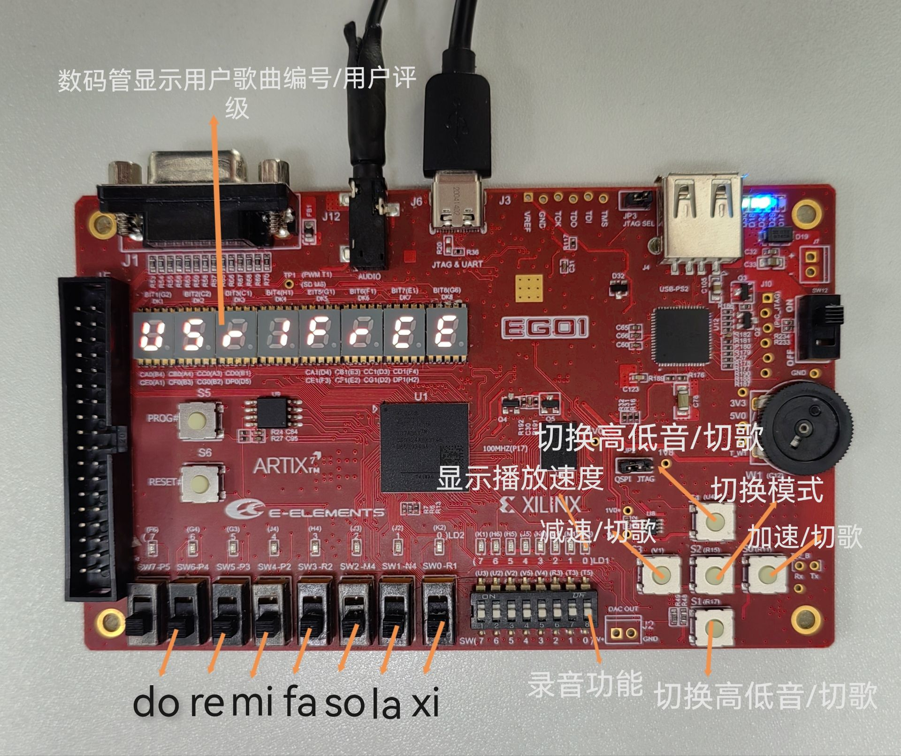
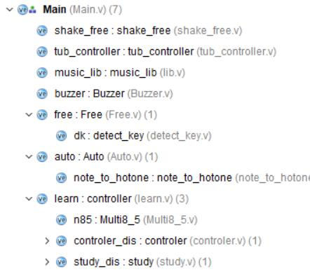
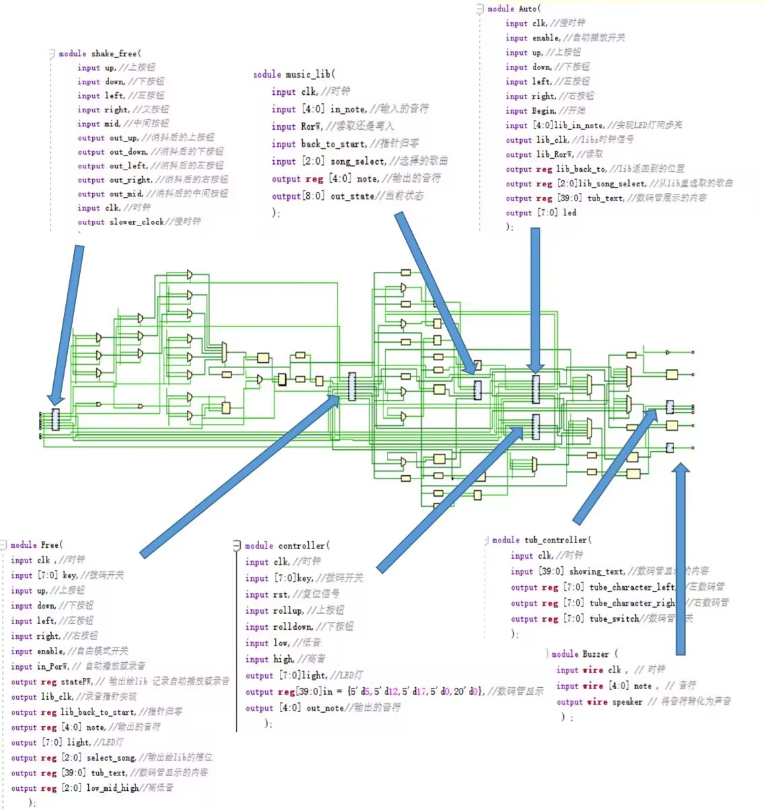

# 数字逻辑project报告

## 0.1 各成员工作以及贡献百分比

|   姓名   |   学号   |   贡献   | 占比  |
| :------: | :------: | :------: | :---: |
| 刘陈加一 | 12212522 | 代码合并 | 33.3% |
|          |          | 自动播放 |       |
|          |          | 录音功能 |       |
|          |          |  数码管  |       |
|  王禀钦  | 12210723 | 代码合并 | 33.3% |
|          |          | 学习模式 |       |
|          |          |  数码管  |       |
|          |          |  报告撰写  |       |
|  张声涛  | 12210730 | 代码合并 | 33.3% |
|          |          | 自由模式 |       |
|          |          | 乐谱制作 |       |
|          |          |  报告撰写  |       |

## 0.2 开发计划日程安排和实施情况

|      时间      |   安排   |   实施情况   |
| :--: | :--: | :--: |
|  12月2日    |  文档解读与分工安排    |   完成   |
|   12月3日   |   自由模式   |   完成   |
|   12月10日   |  自动播放    |   完成   |
|   12月17日   |   学习模式   |   完成   |
|   12月24日   |   录音功能与速度切换   |  完成    |
|   12月25日   |   数码管   |   完成   |
|   12月30日   |   学习模式评分功能   |   完成   |
|   1月1日   |  项目调试    |   完成   |

## 1. 系统功能列表

|  功能 |  特性 |
| :--: | :--:|
|  自由模式 |支持高低音切换   |
|  自动播放 |支持多首歌曲切换，可变换播放速度   |
|  学习模式|支持多首歌曲切换，支持实时评分   |
|  录音功能|支持变换播放速度，可实现覆盖功能    |

### 1.1自由演奏模式

1. 进入模式，数码管会显示“FREEPLAY”字样  
2. 在未经过调整模式调整按键的情况下，可以从左往右弹出do,re,mi,fa,so,la,si七个音，并实现三个八度的自 由切换。  
3. 每个音符发声的同时，琴键上方的led会亮起。 
4. 如果想要录音，将录音按键打开后便会进入录音模式，记录用户演奏内容，录音按键关闭后则结束录音， 且录音可以在自动演奏模式，学习模式播放，并且新的录音文件能够自动覆盖先前的。  

### 1.2 自动演奏模式

1. 调整到自动演奏模式之后，会进入选曲模式中。此时，用户可以通过开发板右侧左右按键选择要播放的曲子。 
2. 每移动到一首曲子，数码管就会显示这首歌曲的名称缩写及其编号。如果移动到自由模式录制的曲子时，数码管会显示对应的序号。  
3. 在按下开发板右侧中间按键确定曲目后，开始播放对应选曲的音乐，每一个音符播放的同时，对应的音符的led也会亮起。
4. 播放曲子时，每个音符之间会有小的停顿，并且根据歌曲实际的音符长度控制每个音符的时间，提升听歌体验。  
5. 曲库内有4首默认曲子：江南，生日快乐，圣诞快乐，小星星。在数码管上分别显示为：JN, HB, CS,  LS。  
6. 曲库内还可以保存4首用户录制弹奏的曲子。  

### 1.3 学习模式

1. 调整到学习模式之后，会进入选曲模式中。此时，用户可以通过开发板右侧上下按键选择要播放的曲子。  
2. 按下确认键后则开始进入学习模式，根据要弹奏的内容琴键上方的led灯会亮起。用户正确按下对应的琴 键后，这个led灯会熄灭，下一个音符对应的led灯会亮起。  
3. 声音会随着用户的演奏响起。
4. 数码管会显示所选择的曲目、当前的失误数和基于失误数的评级，失误数与评级提供实时反馈。

## 2. 系统使用说明



## 3. 系统结构说明





## 4. 子模块功能说明

|  模块    |   功能   |
| :--: | :--: |
|  shake_free   |   消抖   |
|  music_lib   |  乐谱库和录音存储库    |
|   Free   |   自由演奏   |
|   Auto   |   自动播放   |
|   controller  |   学习模式控制器   |
|   tub_controller    |   数码管显示   |
|   Buzzer   |  蜂鸣器    |

### 4.1  shake_free 消抖

```verilog
   module shake_free(
    input up, //上按钮
    input down, //下按钮
    input left, //左按钮
    input right, //右按钮
    input mid, //中间按钮
    output out_up, //消抖后的上按钮
    output out_down, //消抖后的下按钮
    output out_left, //消抖后的左按钮
    output out_right, //消抖后的右按钮
    output out_mid, //消抖后的中间按钮
    input clk, //时钟
    output slower_clock //慢时钟
    );
```


   本模块通过分频器生产的慢时钟slower_clock实现上(up)下(down)左(left)右(right)中(mid)五个按钮的消抖,本项目其他模块的clk均使用慢时钟slower_clock，按钮均使用该模块产生的消抖后的按钮。

   ### 4.2 music_lib 音乐库

```verilog
module music_lib(
    input clk,//时钟
    input [4:0] in_note,//输入的音符
    input RorW,//读取还是写入
    input back_to_start,//指针归零
    input [2:0] song_select,//选择的歌曲
    output reg [4:0] note,//输出的音符
    output[8:0] out_state//当前状态
    );
```

​	本模块实现了自由演奏的乐谱读取以及录音模式的乐谱输入与存储，其中RorW=0时，实现读取功能,用于Auto的乐谱获取， RorW=1时实现写入功能，用户在自由模式弹奏的音符将被记录下来。

### 4.3 Free 自由演奏

```verilog
module Free(
input clk , //时钟
input [7:0] key, //拨码开关
input up, //上按钮
input down, //下按钮
input left, //左按钮
input right, //右按钮
input enable, //自由模式开关
input in_PorW, // 自动播放或录音
output reg statePW, // 输出给lib 记录自动播放或录音
output lib_clk, //录音指针实现
output reg lib_back_to_start, //指针归零
output reg [4:0] note, //输出的音符
output [7:0] light, //LED灯
output reg [2:0] select_song, //输出给lib的槽位
output reg [39:0] tub_text, //数码管显示的内容
output reg [2:0] low_mid_high //高低音
    );
```
自由演奏模块中，用户拨动拨码开关，对应的音符note，将被输送到Buzzer模块实现发声，light将输送到LED灯。用户通过按上(up)下(down)按钮实现高低音的切换。

用户打开录音功能时，左(left)右(right)键可以用来选取录音存储的槽位，按下确定按钮后，用户弹奏的音符将被记录在music_lib中，再次按下确定键后，将停止录音，该模块使用的按钮均为shake_free模块消抖后的按钮。


### 4.4 Auto 自动播放

```verilog
module Auto(
    input clk,//慢时钟
    input enable,//自动播放开关
    input up,//上按钮
    input down,//下按钮
    input left,//左按钮
    input right,//右按钮
    input Begin,//开始
    input [4:0]lib_in_note,//实现LED灯同步亮
    output lib_clk,//libs时钟信号
    output lib_RorW,//读取
    output reg lib_back_to,//lib返回到的位置
    output reg [2:0]lib_song_select,//从lib里选取的歌曲
    output reg [39:0] tub_text,//数码管展示的内容
    output [7:0] led
    );
```

​	进入自动播放模式后，用户可通过上(up)下(down)键切换歌曲，同时也可以选择播放录音，tub_text输出使得数码管将会实时更新歌曲或录音的名称，按下确定按钮后，开始播放，通过左(left)右(right)键可以实现加快和减慢音乐播放的速度，音乐播放的速度一共有八个等级，为了防止越界，8的下一个状态切换为1，1的下一个状态切换为8，该模块使用的按钮均为shake_free模块消抖后的按钮。音符lib_in_note，将被输送到Buzzer模块实现发声，以及输送到LED灯。

### 4.5  controller 学习模式控制器

```verilog
module controller(
input clk,//时钟
input [7:0]key,//拨码开关
input rst,//复位信号
input rollup,//上按钮
input rolldown,//下按钮
input low,//低音
input high,//高音
output [7:0]light,//LED灯
output reg[39:0]in = {5'd5,5'd12,5'd17,5'd0,20'd0},//数码管显示
output [4:0] out_note//输出的音符
);
```

在学习模式中，key是用户输入的拨码开关，用户可通过上(up)下(down)键切换歌曲，同时也可以通过左(left)右(right)键切换高低音，该模块使用的按钮均为shake_free模块消抖后的按钮。

当用户开始弹奏后，错误的数量和当前等级将会被in(数码管显示信息)输送到tub_controller(数码管)显示。音符out_note，将被输送到Buzzer模块实现发声，light将输送到LED灯。

### 4.6 tub_controller	数码管显示

```verilog
module tub_controller(
    input clk,//时钟
    input [39:0] showing_text,//数码管显示的内容
    output reg [7:0] tube_character_left,//左数码管
    output reg [7:0] tube_character_right,//右数码管
    output reg [7:0] tube_switch//数码管开关
    );
```


showing_text传入的是由自由演奏、自动播放、学习模式、录音模式中输出的数码管信息，为了让每一个数码管显示不同的符号，我们使用流水灯的方法，依次改变打开的数码管(tube_switch)，由于闪烁的速度很快，人眼很难识别,看上去8个数码管都是亮的。

### 4.7 Buzzer 蜂鸣器

```verilog
module Buzzer (
 input wire clk , // 时钟
 input wire [4:0] note , // 音符
 output wire speaker // 将音符转化为声音
  ) ;
```


  输入note是是由自由演奏、自动播放、学习模式、录音模式中输出的音符， speaker将音符转化为声音

## 5. bonus 的实现说明

* 录音模式，在自由播放模式下打开录音开关，用户按下的键的顺序和位置将会被记录到music_lib模块中，当用户按下结束键时停止录音，然后用户可在自动播放模式下选中该录音，录音将会按照music_lib模块中存储的音符播放。如果用户再一次选择该槽位，实现覆盖操作。
* 关于评分的实时更新更加精细和合理：在学习模式中，根据用户按键的时间提供实时变化的评分，数码管的状态更新是在每一个时钟上升沿实现的，一旦输入数码管的信息变化，数码管显示的评分将实时更新。
* 音乐的节奏更多变化： 在乐谱设计中，我们用数组的4个位置表示一个音符，用0来表示音符之间的间隔，同时可以通过填充不同个数的相同音符来实现不同音符演奏的时值不同。例如1100表示八分音符，1000表示十六分音符。
* 音乐的播放快慢速度可以调整，我们用计算时钟上升沿的个数来确定音符时长，按下左键时，计算的上升沿个数增加，音符的时长会增加，播放速度减慢，按下右键时，计算的上升沿个数减少，音符的时长会减少，播放速度减慢，音乐播放的速度一共有八个等级，0最慢，7最快，为了防止越界，7的下一个状态切换为0，0的下一个状态切换为7。

## 6. 项目总结

### 6.1项目收获

本次项目我们熟练地掌握了状态机的书写，顶层模块的设计，不同模块之间的配合，以及数码管，蜂鸣器的工作原理，同时也收获了很多小组配合的经验。

### 6.2探索与发现
#### 6.2.1利用流水灯实现数码管显示8个不同字符

 我们利用流水灯的特点，让8个数码管的开关以较高频率依次循环打开，人眼看上去8个数码管都是亮的，且显示的内容都不同。此外，我们还发现当慢时钟频率为原时钟的2的16次方之一时数码管显示效果最佳，频率太低会有炫目效果。

#### 6.2.2“状态锁”的使用
由于我们使用按钮实现切换歌曲，如果一直按着按钮，状态机将会飞快地切换状态，而我们只希望它切换一次状态，于是我们使用了自创的“状态锁”。

```verilog
 always @* begin
    if({up,down,left,right,Begin}!=next_state_lock)
    begin
    if(up)
        next_song = song_select+1;
    if(down)
        next_song = song_select-1;
    if(left)
        next_bpm = bpm+1;
    if(right)
        next_bpm = bpm-1;
    if(lib_in_note==5'b1_1111)
        next_isPlay = 1'b0;
    else
        begin
        if(Begin)
           next_isPlay = ~isPlay;
        end
    next_state_lock={up,down,left,right,Begin};
    end
    end
```

上述代码是自动播放的选歌状态机，当任意一按钮按下时，状态只转变一次，next_state_lock将变成{up,down,left,right,Begin}，由于next_state_lock=={up,down,left,right,Begin}，状态被锁住，状态机将不会切换状态，除非松开按钮再按。

## 7. project出题

实现一个计算器

* 基础部分
	* 可以根据输入在数码管上现实对应的符号
	* 可以实现一些基础的计算功能
	* 可以实现一些练习功能，根据算式给出对应的答案，并且可以判断是否正确，正确之后在声音上有提示
	* 按特定的按键会有特定的声音
* 标准功能
	* 实现一个空闲模式，按下特定的按键可以播放不同的歌曲
	* 计算中可以出现小数，括号，甚至乘方，指数，对数等更高级的功能
	* 输入之后可以改变输入的内容
	* 可以实现一个题库供练习者练习，并判断计算是否正确

* bonus
	* 判断用户输入是否合法，对于不合法的输入有特定的音效
	* 实现多用户，不同用户可以根据正确率打分，并记录
	* 打分时可以根据用户的反应时间进行更为精确的打分
	* 对于小数的位数有比较精确的限制，并降低高级功能的计算误差
	* 对题库的难度可以自由选择
